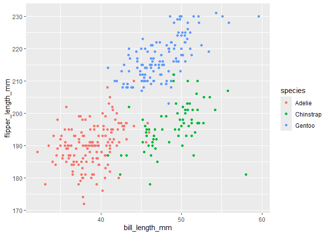

p8105_hw1_jw4690
================
Jingxi Wang
2024-09-12

``` r
library(tidyverse)
```

    ## ── Attaching core tidyverse packages ──────────────────────── tidyverse 2.0.0 ──
    ## ✔ dplyr     1.1.4     ✔ readr     2.1.5
    ## ✔ forcats   1.0.0     ✔ stringr   1.5.1
    ## ✔ ggplot2   3.5.1     ✔ tibble    3.2.1
    ## ✔ lubridate 1.9.3     ✔ tidyr     1.3.1
    ## ✔ purrr     1.0.2     
    ## ── Conflicts ────────────────────────────────────────── tidyverse_conflicts() ──
    ## ✖ dplyr::filter() masks stats::filter()
    ## ✖ dplyr::lag()    masks stats::lag()
    ## ℹ Use the conflicted package (<http://conflicted.r-lib.org/>) to force all conflicts to become errors

## Problem 1

``` r
library(palmerpenguins)

data("penguins", package = "palmerpenguins")
```

The key variables are `species`, `island`, `bill_length_mm`,
`bill_depth_mm`, `flipper_length_mm`, `body_mass_g`, `sex`, and `year`.

The penguins dataset has 344 rows, 8 columns.

The mean of the flipper length is 200.9152047 mm.

``` r
ggplot(penguins, aes(x = bill_length_mm, y = flipper_length_mm, color = species)) + geom_point() 
```

    ## Warning: Removed 2 rows containing missing values or values outside the scale range
    ## (`geom_point()`).

<!-- -->

``` r
ggsave("penguins_scatterplot.png", device = "png")
```

    ## Saving 7 x 5 in image

    ## Warning: Removed 2 rows containing missing values or values outside the scale range
    ## (`geom_point()`).

## Problem 2

``` r
p2_df = 
  tibble(
    sample_normal_dis = rnorm(10),
    logical_vector = rnorm(10) > 0,
    character_vector = letters[2:11],
    factor_vector = factor(rep(c("Lv1", "Lv2", "Lv3"), length.out = 10))
  )
```
